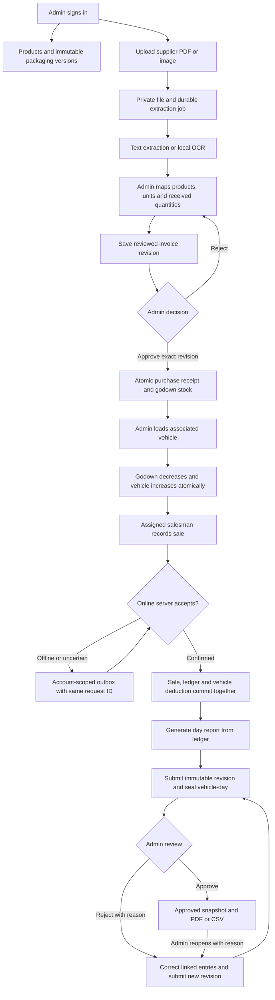

# Architecture and operational rules

## End-to-end flow

## Units and history

A product has a fixed canonical smallest unit after stock/history exists. Each packaging version stores descending levels and each level's multiplier into that base unit. Every next level divides the previous level exactly; the last multiplier is one. This makes greedy decomposition lossless and deterministic. Inputs reject fractions, overflow, duplicate codes, invalid hierarchies and stale configuration IDs.

Transactions retain the entered quantity, unit, packaging ID and the full conversion snapshot. Live stock uses the current packaging; saved reports use their own snapshot. Price metadata is kept in the catalogue with an explicit currency and unit. Quantity sales do not invent money amounts, tax rules, customers or payment records.

## Transaction boundary

Server authentication supplies the actor. The client cannot choose another actor or write a balance. A business operation validates its payload, locks the write boundary, rechecks current account/scope, checks its idempotency record, locks affected balances, writes the document and append-only ledger, updates balances, audits the operation, saves the result and commits. One failing line rolls back all lines. A retry with the same request and payload returns the saved result; changed payload is rejected.

For transfers, source and destination are linked to the same document. For corrections, the original sale remains; a reversal and replacement link together. A posted invoice's received stock is corrected by a reasoned adjustment linked to that invoice/receipt, subject to available stock. Posted snapshots and ledger history have database-level mutation guards.

## Daily reports

The calculation is `opening + loads - gross sales + reversals + signed adjustments = closing`. Opening uses movements before the business date. Report generation does not imply a physical stock count.

Submission saves a snapshot, packaging ratios, business name, godown, location, timezone and a source hash. Saved headers survive later master-data renaming; older revisions explicitly identify metadata that was not captured. Admin decision checks both the revision and its source. Previous revisions and decision events remain available. Report decisions produce no stock movements. Submitted/approved vehicle-days reject ordinary writes; another business day remains usable. Older corrections are posted at the current time and appear as later amendments, keeping old as-of balances intact.

Business timestamps are UTC; the configured business timezone determines day boundaries. The timezone becomes fixed after inventory postings to avoid moving records between historical days.

## Files and extraction

Files use random IDs, MIME-signature validation, SHA-256 integrity checks and private filesystem permissions. User filenames are metadata, never paths or commands. Only active admin sessions can retrieve original invoices. PDF tooling is invoked with argument arrays. PDF text, OCR text and CSV content are data, never executable instructions.

English OCR is local through Tesseract.js and the bundled licensed model. Product matching normalizes tokens, retrieves candidate products through an inverted index and scores matches. Suggestions retain source text and uncertainty. There is no automatic stock effect from uploading or extracting. The admin explicitly confirms product, conversion and physical received quantity.

Queue jobs are written to disk before processing. The single server resumes pending work on authorized state access after restart. For higher availability, replace this filesystem queue with a leased multi-worker queue and shared object storage; do not add a second independent writer to the same local queue.

## Data ownership and legacy migration

The version 2 schema is `sanket`. It begins with empty operational records. The reference project's `distribution` schema and any real previous records remain untouched. Legacy data cannot be copied blindly: a single warehouse quantity cannot determine how much belongs to Hardpiplya versus Dewas. Map warehouse identities, active vehicle assignments, canonical units, opening balances and historical commercial records through a reviewed migration before importing a real legacy database.

CSV import first parses and previews exact source values, duplicate candidates and unresolved fields. Confirmation is parsed again on the server, and its validated plan is preserved for retries. The original `Allu Bhumiya` spelling and `snaks` category remain unchanged. `Packaging=1` is retained as unresolved raw source data, `Warehouse=0` creates no stock or warehouse identity, and `Selling price=200.00` has no assumed unit basis.

## Operational limits

The initial deployment uses one business/owner workspace, one Node process and a PostgreSQL database. Background phone GPS is not guaranteed. English OCR is available; invoices in other scripts can be entered manually until additional language models are deliberately configured. Scanned text can misread characters, so review remains required. Saved report revisions have authenticated PDFKit-generated PDF downloads with bundled licensed fonts and page numbering, plus CSV export and a browser print option. Hosting/domain provisioning and a production backup schedule require the actual deployment environment.
